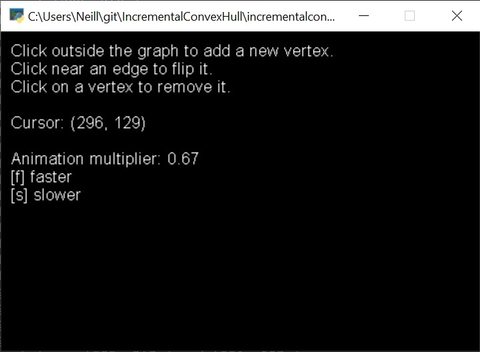
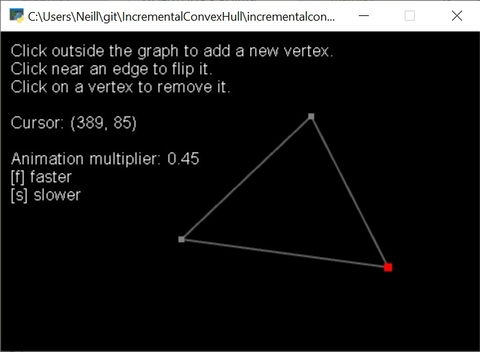
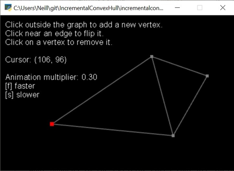

# Usage Walkthrough

After firing up the GUI, you are greeted with a black screen showing a few statistics in the upper left.

As a matter of fact, you're looking at a graph right now: a graph with no vertices and no edges.

Clicking on any area on the screen will create a vertex at the cursor's location.
Try adding three vertices, anywhere you want!
The program will automatically add edges between your vertices, creating a triangle.

You'll notice a few graphical features as you construct that nifty triangle of yours.

* Once two vertices are in the graph, the program will display faded edges between your cursor's location and the two vertices that would be connected to a new point created at the cursor.

  

* Hovering over any vertex will highlight it red. If you click on that vertex, it will be removed from the graph.

A triangle, by definition, is a *convex* polygon.
There are no "dents" in its border as you follow the edges around the shape.

This graph utility maintains the *convex hull* of the point set: a convex polygon that covers all points in the set.
All triangles are convex.
Once you make a triangle, though, **you may only add points to the graph that expand the convex hull**.

Try it out: clicking inside your triangle won't do anything, but click outside, and you'll get a new vertex!

You may have found that, after clicking, one of your original three vertices was removed, and your new polygon is still a triangle.
The graph utility **automatically removes** vertices that wind up within the convex hull of a point set.
So, if you chose to add a vertex in the location specified in the following image, you should expect the bottom-most vertex to be removed.

Anyway, you've got yourself a quadrilateral now, but you've also got that diagonal edge.
When you hover over it, it turns a startling shade of blue.
What's up with that?

In addition to maintaining a convex hull, this graph utility also maintains a valid *triangulation* of the hull.
"Triangulation" is just a fancy term for "cutting our convex cake into triangles."
Now, the intrepid observer among you might claim that there's more than one way we could have triangulated our quadrilateral.
You're right!
If you click on that bold blue edge, it will kindly slide right over into the other valid position.

Neat!

Four is still quite a limiting number of vertices to experiment with.
Let's try adding another.
As we guide our cursor around our graph searching for the most beautiful location for our next point, we may notice a mysterious pale red line appear on the screen:

What is that sneaky fellow doing there?
Let's investigate.
Inspect the graph, and consider what would happen if we added a vertex at the current location.
Notice that the pale red edge completes a triangle started by the two new edges connecting to our candidate vertex.
Furthermore, all vertices that fall *within* that outlined triangle will be eliminated from our graph if that new vertex is added!
What happens to the existing edges that are incident to the vertices on death row?

In short, one does not simply add vertices to a convex hull graph.
We have to prepare the graph for a clean removal.

How? **By flipping edges!**

Add that troublesome new vertex, and watch the graph resolve itself.

"Well, la-de-flipping-da," I hear you say.
"I could have done that myself before adding the vertex."

Of course you could have, dear student!
I am confident that, even with half a dozen edges to flip, you and I could clear the way for the pale red edge with a few well-chosen flips.

The question is, can the computer do the same? Let's make a new graph to find out!

Click on each of the vertices in your current graph to delete them.
Then, make an American football shape as shown below:

I'll leave the details of this construction as an exercise to the reader.
Hint: you won't flip any edges or remove any vertices.
How could you add those triangles without causing any flips or deletions?

Once you've got that iconic pinched ovoid on your screen, move your cursor down far below the graph.
*Look at all those edges needing a good flip*.
How do you think the computer will handle all of those flips?
What will the resulting graph look like?

Take a deep breath, and when you're prepared for the onslaught of edge manipulation, click to add the lower vertex.

Shazam!
You've turned a football into an ice cream cone!

At this point, you've seen the extent of the program's intended use case.
For those looking to use this graph utility as a library in their own software development, I encourage you to check out the [official API documentation](https://hactarce.github.io/IncrementalConvexHull/) to get started exploring the codebase.
For those who are still curious about this algorithm's various edge cases, keep poking around in the visualization: exploration is the best teacher!
